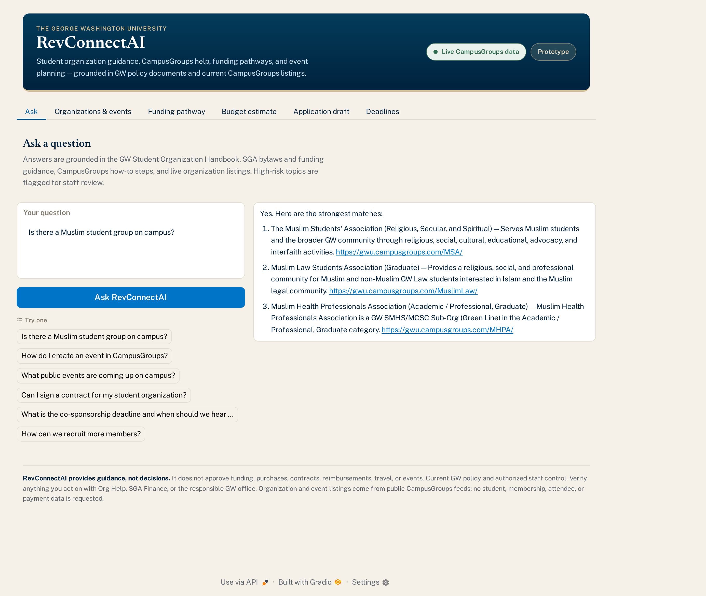

# RevConnectAI

A retrieval-augmented assistant for George Washington University student
organization support. It answers policy and how-to questions from GW's student
organization handbook, SGA bylaws, and funding guidance; recommends
organizations and upcoming events from GW's live CampusGroups feeds; and helps
plan event budgets and funding applications.

RevConnectAI provides guidance, not decisions. It does not approve funding,
purchases, contracts, reimbursements, travel, or events. Current GW policy and
authorized staff control.



## What is not in this repository

The five GW source PDFs (Student Organization Handbook, SGA Bylaws, Finance
Committee, Applying for Funding, Frequently Asked Questions) and the
knowledge-base ZIP that contains them are **not** redistributed here. Place your
own copies in `RevConnectAI_Knowledge_Base_v4/` before running; the loader picks
up any PDF it finds there. Everything else — the derived CSVs, the API client,
the interface — is included.

## Running it

```bash
python3 -m venv .venv
.venv/bin/pip install -r RevConnectAI_v5_API_Prototype/requirements.txt

.venv/bin/python run_local.py          # build the index, run the test questions
.venv/bin/python run_local.py --ui     # also serve the interface on 127.0.0.1:7899
```

## Cloudflare deployment

The free web edition lives in `public/` and is configured as a Cloudflare Worker
with static assets at `cjsrxzdyzds.com`. It keeps organization search, public
event discovery, published how-to and funding guidance, a budget estimate, and
an application draft. Its question box ranks matching public records; it does
not run the notebook's local language or embedding models. The original
Python/Gradio prototype remains available through `run_local.py`.

The organization directory and fallback event list are sanitized snapshots in
`public/data.json`. The Worker fetches up to 60 nearest public events from the
CampusGroups RSS feed and returns only the fields the page displays. The page
shows when data was checked and links users to RevConnect and official guidance.
No CampusGroups credential is required. The five source policy PDFs are absent
from this repository, so the web edition does not make page-cited policy claims.

To refresh the public snapshots and deploy:

```bash
npm ci
npx wrangler login
npm run refresh-data
npm run deploy
```

`npm run refresh-data` reads only published organization and public event RSS
fields. If its upstream feed is unavailable, keep the existing `public/data.json`
and run `npm run deploy`. After deployment, visit `https://cjsrxzdyzds.com/`
and test one search, one budget, and the event feed. The free Workers tier has
[request and CPU limits](https://developers.cloudflare.com/workers/platform/limits/);
the website is designed to stay within them by serving most content as static
assets.

`run_local.py` executes the notebook's code cells outside Colab: the `/content`
project directory is redirected to `./.revconnect_local`, and Gradio binds
localhost instead of opening a public share tunnel. The notebook itself still
runs unmodified in Colab.

## CampusGroups

The `rss_groups` and `rss_events` feeds are **public and need no credential**.
Do not set `CG_API_KEY` or `CG_API_SECRET`: the feeds answer an anonymous
request with HTTP 200 but reject an unrecognized `X-CG-API-Secret` header with
HTTP 403, so a stale value breaks a connection that would otherwise work.

Feeds are served per tenant at `https://<school_code>.campusgroups.com`;
`school_code` defaults to `gwu`. Verify with:

```bash
cd RevConnectAI_v5_API_Prototype && python api_connection_smoke_test.py
```

As of 2026-07-28 that reports 722 organizations and 22 upcoming events.

### Developer APIs

CampusGroups has more than the public RSS feeds used here:

| Interface | Purpose | Access |
|---|---|---|
| [RSS groups and events](https://www.campusgroups.com/api?public=1) | Published group and event data | Public fields can be read without a credential; this is what the free web edition uses. |
| [Data API](https://www.campusgroups.com/api?public=1) | SOAP/XML queries and real-time create/update operations | Requires institution-level API credentials and appropriate authorization. The API key is listed under Admin > Settings > General Settings > Integration & API. |
| [Data Export API](https://docs-prod-us-east-1.service.campusgroups.com/service-data/index.html) | Read-only REST/JSON bulk exports | Requires a school API secret; availability for GW and any Data Intelligence entitlement must be confirmed with its platform administrators. |

The current deployment needs no privileged API access. Never put a school API
secret in `public/`, client-side JavaScript, or Git. If GW authorizes a future
integration, keep the credential on the server side and request only the data
needed for that feature. These APIs exchange CampusGroups data; they do not
provide application hosting or control of RevConnect URL routes.

### RevConnect Pages integration

GW's [RevConnect](https://students.gwu.edu/student-organizations) is powered by
CampusGroups and runs at `revconnect.gwu.edu`. A group website gets a path such
as `revconnect.gwu.edu/<group-acronym>/`. Inspection of the Pages interface on
2026-09-24 showed page and menu creation, a rich-text Widget editor with an HTML
Source mode, and Website Settings for custom CSS and JavaScript. Its "Primary
website" setting can redirect the **entire group website** to the URL saved
under Dashboard > Settings > Address: Website.

For this project, the lowest-effort integration is a link from a group page or
menu to `https://cjsrxzdyzds.com/`, while Cloudflare continues to host the app.
An in-page embed may be possible through a Widget or page HTML, but iframe/HTML
filtering, browser framing rules, and the app's behavior inside RevConnect have
not been tested. A redirect should only be configured for a group website whose
owners want to replace that whole site's landing address. Hosting the app at a
platform-level path such as `revconnect.gwu.edu/revconnect-ai/` requires GW and
CampusGroups administrators to confirm routing support and authorize it; the
group Pages interface does not expose that deployment control. No RevConnect
page or setting was changed during this inspection.

## Layout

| Path | What it is |
|---|---|
| `RevConnectAI_Full_Student_Engagement_Assistant_v5_API.ipynb` | the assistant, end to end |
| `RevConnectAI_v5_API_Prototype/campusgroups_api_client.py` | read-only CampusGroups client (source of truth) |
| `revconnect_ui.py` | the Gradio interface (source of truth) |
| `sync_notebook.py` | regenerates the notebook cells that inline the two files above |
| `run_local.py` | runs the notebook outside Colab |

The notebook stays self-contained so it runs in Colab with nothing but the
knowledge base, which means the API client and the interface each exist twice —
as an editable module and as a notebook cell. `sync_notebook.py` regenerates the
cells from the modules so the copies cannot drift:

```bash
python sync_notebook.py           # regenerate
python sync_notebook.py --check   # fail if they have drifted
```

## Data scope

The deployed web edition uses only public organization and event data
(`privacyLevel` 0 for events). No user, membership, officer, attendee,
transaction, or payment data is requested, and no write endpoints are used.
The original Python prototype's API client also permits `privacyLevel` 1
(authenticated campus community) in its configuration; see `CHANGELOG_v5.txt`
for how to restrict that client.
