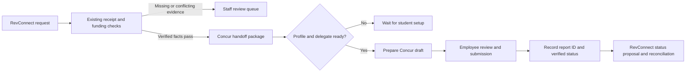

# RevConnect to SAP Concur Reimbursement Integration

Research date: September 26, 2026. Status: proposed design with browser and supplied-template inspection. The user subsequently authorized trying a new report, requiring confirmation of every value before entry. A report was created in the verified student delegate context after the header values were confirmed. Its saved header was reopened and verified. At the last agent verification, the report was unsubmitted, with one saved expense and its user-authorized combined PDF receipt attached and verified in the expense viewer. The user subsequently reported completing the follow-up; the agent did not independently verify later submission, approval, or payment status. The user-confirmed expense type and other confirmed entry values were saved and verified. No API calls were performed. The application project remains paused.

## Recommended starting point

The office confirmed that reimbursements use **Concur Expense Reports**. Staff act as the student's **Delegate**, create reports, and submit them. The first pilot should reduce repeated entry of amounts, purchase dates, and accounting codes, and assemble reimbursement evidence. These are confirmed office requirements, not proof of tenant integration access.

Prepare a reviewed reimbursement handoff package, create an unsubmitted Concur draft through an authorized integration or assisted UI, and let the responsible employee review and submit in the existing delegate workflow. Track the resulting report and payment separately. This is an incremental proposal, not an established integration.

## Confirmed route and prerequisites

GW's student guidance says ordinary students complete their profile and banking information, designate a GW employee as delegate, and may prepare a report and upload receipts. An employee reviews and submits for departmental approval. Student employees have a different submission and banking process. The guidance also distinguishes direct deposit from check requests and tax-reportable payments. Track readiness without collecting bank account details in the agent's case record. [GW student processing guidance](https://ibuy.gwu.edu/processing-students-concur-ibuy).

The confirmed route is Expense Report; Concur Invoice is outside this pilot. GW's separate Invoice guide does not establish an Expense Report integration method. [GW Invoice guide](https://procurement.gwu.edu/ibuy-invoice-quick-reference-guide).

Check the student's profile readiness and the employee's preparation, receipt-viewing, and submission rights for each case. The office's use of delegates does not establish that every student has completed setup. The student remains the report owner and reimbursement recipient; the delegate is the acting employee. [GW delegate permissions](https://ibuy.gwu.edu/sites/g/files/zaxdzs4686/files/2022-06/exp-delegate-add-edit-or-delete-9-16-20.pdf).

## First pilot: verified entry and evidence preparation

Produce a staff-reviewable entry worksheet before choosing an API or browser implementation. Every populated value should have a source reference; absent or ambiguous values remain unresolved rather than being guessed.

| Field or artifact | Authoritative input | Agent preparation | Review requirement |
| --- | --- | --- | --- |
| Report owner | Verified student identity and Concur profile | Match the recipient to the Concur owner | Resolve identity conflicts and confirm delegate access |
| Report header | Request, event, and office convention | Draft an English report name and business purpose; preserve the request reference | Confirm required tenant fields and naming convention |
| Purchase date | Each original receipt | Extract each purchase date separately | Resolve unclear dates; do not substitute request or upload date |
| Amount | Original receipts and reviewed exclusions | Reconcile eligible receipt amounts to the requested total using integer cents | Confirm exclusions and exact agreement before entry |
| Expense type | Office category mapping and receipt contents | Suggest only a mapped, supported type | Review missing mappings and receipts with mixed categories |
| Accounting codes and allocation | Approved organization, submitted funding split, budget line, and confirmed funding-code mapping | Map Budget to `542302` and Revenue to `542801`; verify allocation totals | Confirm the target Concur field and any additional organization-specific fields |
| Receipt and event evidence | Original paid, itemized receipts; flyer or attendee list when required | Create an evidence manifest linking each file to its intended entry | Verify readability, payment evidence, and correct attachment placement |
| Report linkage | Created Concur objects and source request | Record request, report, entry, and attachment identifiers where available | Reconcile partial failures before retrying |

The eligible reimbursement amount is the combined receipt total minus ineligible item amounts. Under the confirmed office rules, all tax, shipping, and tips remain included. The combined eligible amount must be strictly greater than $25 and strictly less than $500, and the requested amount must exactly equal it. Preserve the original gross receipts and record the exclusion calculation; do not alter receipts to make them match. Whether Concur requires itemization or a particular treatment of excluded items must be checked in the tenant.

Apply the existing reimbursement checks before preparing a ready-for-entry package: each receipt needs a purchase date, item list, paid confirmation, and credit-card last-four evidence; each purchase must fall within the 60-day submission window; the RevConnect submitter must differ from the reimbursement recipient; and food requires a flyer or attendee list. Gasoline, transportation, and hotel claims go to staff review. Flowers and ammunition are known ineligible examples, not a complete category list. Record verification results without copying card digits into the general handoff worksheet.

One RevConnect request may contain multiple receipts. The number of Concur entries and any itemization must follow the office's confirmed entry practice. Retain dates, amounts, categories, and evidence separately until that mapping is known; do not collapse them into one expense automatically. Funding checks continue to use verified system balances and the submitted split under the existing decision policy.

### Confirmed funding-code mapping

The office supplied the following mapping on September 26, 2026:

| Funding source | Code |
| --- | --- |
| Budget | `542302` |
| Revenue | `542801` |

Treat the values as strings in the handoff record. Apply each code to its corresponding submitted allocation; do not replace a mixed funding split with one code for the entire request. Searching the new-report Oracle Alias selector for `542302` returned **(542302) STUDENT ORGANIZATIONS**. The user confirmed replacing the recipient's default with this value; it was selected and verified again in the saved report header. `542801` has not yet been looked up in the tenant. This is not a category-to-expense-type mapping and does not settle mixed-source expense allocations, technical field identifiers, or other required accounting dimensions.

### Confirmed reimbursement material set

The office described four components of the reimbursement materials. This establishes the package contents, not the number of Concur expense entries.

| Component | Preparation task | Remaining confirmation |
| --- | --- | --- |
| Expense heading template | Populate the supplied, separate PDF cover's four fields from verified case facts | The user explicitly allowed a blank GWID for the pilot; future cases require verified values or an explicit blank-field decision |
| CampusGroups request printout | Preserve the request's printable representation and link it to the request ID and revision | Native Save as PDF output verified against request ID, recipient, organization, and amount; approved for the pilot package |
| Receipts | Preserve each original receipt and associate it with its extracted date, amount, and reconciliation result | Combined PDF attached to the selected expense through Upload New Receipt; report-level placement untested |
| Supplementary materials | Associate supporting evidence with the relevant request or expense, including food-event evidence when required | Any category-specific materials |

The office confirmed that these materials are normally combined into one PDF and supplied the heading template for read-only inspection. Use a combined PDF as the default package output, with the listed order confirmed for the pilot. Keep a manifest linking each source document to its page range in the combined PDF, and preserve original receipt contents and readability. The heading and request printout provide context and do not replace original payment evidence. Missing components should be recorded as package-preparation gaps for staff to resolve, rather than introducing unconfirmed reimbursement rejection rules.

The pilot assembled a manifest, populated the supplied heading, and used the same verified record for the Concur field worksheet. Keep document components and expense entries as separate lists so attachment counts cannot accidentally determine financial entry counts. The selected request's native printout, original receipt, and flyer were downloaded or exported and inspected. The user confirmed the printout and package order, and explicitly directed that GWID remain blank for this pilot. A combined local PDF was created and every page rendered and inspected. The cover remains interactive; all four canonical field and widget values, including the empty GWID, and their normal appearance streams were verified after reopening. All original printout and receipt pages were preserved, including source-generated blank trailing pages. A private manifest records file hashes and page ranges. After explicit authorization identifying the file and target expense, the reviewed combined PDF was uploaded through that expense's Upload New Receipt control. The expense-specific viewer showed the expected filename and seven pages, and the missing-receipt alert disappeared. The expense was saved after upload, and the report expense list retained a View receipt control naming the uploaded file, verifying the association beyond the initial viewer. The report remained Not Submitted. No report submission has been performed. The final combined file must use the office-confirmed convention `Student Name_$Amount.pdf`, with the verified reimbursement recipient and amount formatted to two decimal places. This filename is distinct from the Concur report name.

### Read-only template findings

The supplied template is a one-page US Letter PDF with the heading **ORG HELP FINANCE / Reimbursement Request**. It is a separate cover document, not the Concur report header. Four interactive text fields were verified in both the canonical AcroForm field tree and the page's widget annotations, and their rendered values were visually inspected:

| Visible label | PDF field name | Proposed source |
| --- | --- | --- |
| Student Name | `Name` | Verified reimbursement recipient, not the submitting officer |
| GWID | `GWID` | Authorized recipient identity source; confirm against Concur owner |
| Student Organization | `Student Org` | The request's verified organization |
| Amount | `Amount` | Reconciled eligible reimbursement total, formatted to two decimal places |

The template already contains sample personal values. Future generation must replace all four values and verify the resulting logical fields and rendered page; partial replacement could retain another person's details. The sample values do not establish an approval limit or an exception to the confirmed reimbursement policy. No sample name, GWID, organization, or amount is reproduced in this research document, and the source PDF is unchanged.

### CampusGroups and Concur observations

An existing reimbursement request detail exposed the transaction ID, group name and type, budget name, payment type, description, allocation and group-fund amounts, vendor, recipient, purchase date, receipt link, and event-evidence link. Its selected recipient differed from its submitter. A recipient GWID was not visible in the inspected request detail, dashboard summary, or default profile. The user explicitly authorized leaving it blank for this pilot; do not invent an ID or generalize this exception into all cases.

The detail page has **Save as PDF** controls. The native export was activated and inspected. It includes the submitted-by line, organization budget ledger, transaction ID and payment summary, reimbursement form answers, and links to attachments; attachment contents require separate inclusion. Ledger rows for other requests provide organization budget history and must not be mistaken for the exported transaction. Check the explicit Transaction ID and recipient/amount after export, and obtain clarification if the user disputes the page. The pilot printout was expressly accepted after this check. The page also exposes editable answers and Save controls: future read-only intake must avoid edits and use source revisions to detect stale data. Financial ledger deductions are shown as negative amounts; preserve their meaning and reconcile them to the positive requested reimbursement amount instead of copying signed deductions into Concur.

The current Concur session exposes **Profile > Act as Another User**, a delegate option limited to users who granted permission, a name/ID search, and a Switch control. Initial sample searches returned no results; later first-name lookup returned the CampusGroups-selected reimbursement recipient with a matching email. Initial empty or transient search results must not be treated as proof of missing delegation or profile setup.

The user authorized selecting a reimbursement example from CampusGroups. The recipient was matched by name and email, selected from the existing delegate search, and the Switch control was used. The resulting **Acting as** indicator confirmed the intended student context. Both Active Reports and This Year showed no reports for that student. This verifies identity-context access, not every preparation/submission permission, profile completeness, or historical absence outside the inspected filters. The report list was empty before the subsequently authorized draft creation. Student report-header and selected expense-entry fields were then inspected; the inherited Budget default allocation and expense-level receipt placement were subsequently verified. Custom or mixed-source allocations remain unverified.

Future intake should distinguish these outcomes: unresolved identity match, delegate context verified, reports absent under inspected filters, existing report located, and required entry fields verified. Do not confuse an empty report list with missing delegate access. At intake, the selected request was in Initial Review. The agent did not advance its CampusGroups workflow during this Concur pilot. Receipt details were subsequently inspected and reconciled; draft creation and evidence preparation do not constitute final reimbursement approval. Identifying case details are omitted from this public research document.

Only the verified student delegate context contributes to the workflow mapping. Staff personal reports are outside the reimbursement pilot scope. The subsequently authorized new-report dialog and saved draft establish the student header labels and Budget Oracle Alias application. The new-expense form establishes the selected type's field labels; entry saving and the inherited default allocation were subsequently verified; expense-level placement of the reviewed combined PDF was subsequently verified. Report-level placement has not been tested.

The first pilot has three reviewable outputs:

1. A structured entry worksheet with verified values, evidence references, exclusions, and unresolved fields.
2. An attachment manifest organizing the original receipts and supporting event materials without changing source files.
3. An authorized unsubmitted draft compared against the worksheet for owner, dates, amounts, codes, allocation totals, and attachments. This output was prepared and checked through the assisted UI in the pilot.

Measure time spent entering fields and organizing materials, staff corrections, unresolved mappings, and duplicate-entry incidents. Completion means a verified draft is ready for staff submission; draft creation alone is not submission or reimbursement payment.

### Confirmed report header and expense fields

After the user explicitly authorized trying a new report, **Create Expense Report** was opened in the verified student delegate context. After confirmation of all header values, **Create Report** was used and the resulting unsubmitted report was verified. The saved header was reopened to confirm persistence. The following labels were observed directly in the student form:

| Field | Required marker observed | Confirmed value or convention |
| --- | --- | --- |
| Report Name | Yes | `OrgAbbreviation_#RequestNumber_Reimb` |
| Report Date | No | System current-date default retained for this case |
| Travel Destination/Business Purpose | Yes | `Student Org Reimb` |
| What type of travel expenses are you claiming? | Yes | No Travel for this case |
| Start Date | Yes | First day of submission month |
| End Date | Yes | Last day of submission month |
| Expense Group ID | Yes | The George Washington University retained |
| Grant/Non Grant | Yes | (GL) Non-Grant retained |
| Oracle Alias | Yes | (542302) STUDENT ORGANIZATIONS, saved and verified |
| Expense Report For | No | Verified reimbursement recipient retained |
| Comment | No | Blank |
| Travel Allowance | No asterisk observed | No travel allowance retained |

Do not treat system defaults as user-approved values. A separate **Create From an Approved Request** control is visible; its presence does not establish that a CampusGroups approval is a linked Concur Request. Create From an Approved Request was not used; the separate Create Report action created the authorized draft.

The office confirmed the report naming convention `OrgAbbreviation_#RequestNumber_Reimb`, exact business purpose `Student Org Reimb`, and No Travel for this case. Start Date and End Date are the first and last days of the submission month. Report Date is a separate single-date field; the system's current-date value and remaining proposed defaults were explicitly retained for this case. The saved header uses The George Washington University, (GL) Non-Grant, no travel allowance, blank Comment, the verified recipient, and the confirmed Budget alias. A created report must be reused on subsequent turns rather than created again.

For the selected food case, the user chose **52721-PROGRAM DEVELOPMENT ACTIVITY**. This is a case-specific confirmed expense type, not a universal mapping for every food request. The selector displayed 135 expense types. The new-expense form exposes required Expense Type, Transaction Date, Business Purpose, Vendor Name, Payment Type, Amount, Currency, and Is this a Vendor Invoice? fields; optional Business Name, City, Comment, Personal Expense, and Missing Receipt Acknowledgment controls; and Itemizations, Allocate, and receipt upload/selection controls. The user confirmed Out of Pocket and USD for the case. Expense-entry Business Purpose must use the organization name, distinct from the report header purpose `Student Org Reimb`. Purchase date, receipt amount, merchant, Washington DC, blank optional business name/comment, Vendor Invoice No, and unchecked personal-expense/missing-receipt flags were reviewed with the user before entry. One expense was saved when Allocate was opened, and its saved values were verified. The allocation view showed 100% default allocation to `GW-GL-542302`, with no remaining amount; no separate custom allocation was created. **Allocate can save a new expense before opening its dialog** and must therefore be treated as a mutation, used only after entry values are confirmed. The report remains Not Submitted. Before upload, its only observed alert required a receipt. After explicit file-and-destination authorization, the combined PDF was uploaded to the expense, its filename and seven-page viewer were verified, and the alert disappeared.

The selected original receipt's visible purchase date, itemized subtotal plus tax, payment record, and credit-card last-four evidence were inspected, and its total matches the requested amount. Purchase, payment, and print timestamps are distinct and must not be substituted for one another. Rendered pages must be checked alongside extracted text: this source contains hidden order-history text and a visually blank trailing page, so extraction alone could incorrectly include unrelated purchases. Receipt verification does not by itself establish event-evidence sufficiency, duplicate clearance, or final approval. The expense values were confirmed before entry. GWID was explicitly left blank at the user's direction. The user authorized the specific combined PDF upload to the selected expense. The filename, seven-page preview, and disappearance of the missing-receipt alert verified placement. Final report submission remains outside the authorized scope.

PDF generation is technically feasible using the inspected cover's four AcroForm fields. The confirmed cover and evidence were assembled into one PDF and the logical fields, widgets, appearances, page order, and rendered result were verified. The source template contains a printed currency symbol, so the Amount field stores the numeric amount without adding a second symbol. Permission to create a report does not by itself confirm unreviewed values or authorize final submission.

## Integration options

| Option | Proposed use | Evidence needed before implementation |
| --- | --- | --- |
| Handoff package | Verified fields, reconciled amounts, receipt references, event evidence, and an English business-purpose draft | Actual Concur required fields and office coding examples |
| Assisted browser entry | Prepare an unsubmitted draft in an employee's existing authorized session | Delegate rights, school permission, stable field mapping, and tested draft behavior |
| Official APIs | Create a report, attach supported evidence, retrieve status | GW-authorized application, OAuth scopes, tenant configuration, identity mapping, and approved costs |
| Workflow orchestration | Manage review queues, retries, and handoffs around an authorized connector | Existing school licenses and connector operations; orchestration does not grant Concur access |

Reports v4 documents report creation with `expense.report.readwrite`, `TRAVELER` and `PROXY` contexts, form-field discovery, and approval/payment status fields. Public documentation does not confer access. A report header alone is not a completed reimbursement: expense creation, allocation, attendees, and attachments require separately verified operations. [Reports v4](https://developer.concur.com/api-reference/expense/expense-report/v4.reports.html).

Expenses v4 documents reading and modifying existing expenses, with product and identity dependencies. Do not infer expense-entry creation from report creation support. [Expenses v4](https://developer.concur.com/api-reference/expense/expense-report/v4.expenses.html).

Receipts v4 GET covers receipts submitted through that API, not every receipt in Concur. Use the appropriate permitted document interface and verify that an uploaded receipt is actually attached to the intended expense/report; upload success alone is insufficient. [Receipt API limits](https://developer.concur.com/api-reference/receipts/endpoints.html), [Spend Documents](https://developer.concur.com/api-reference/spend-documents/v4.spend-documents.html).

## Handoff record and synchronization

Record the RevConnect request ID, recipient's verified Concur identity, organization, requested amount, eligible amount, each receipt's vendor/date/amount and exclusions, event evidence, staff owner, and approved accounting allocation. Include the confirmed funding codes and a separate manifest for the heading, request printout, receipts, and supplementary materials. Budget-line labels are not Concur expense types or field identifiers. Store evidence references and revisions, not credentials or bank information.

Maintain a durable mapping from request ID to report ID, expense IDs, and attachment IDs where supported. Confirm whether one request maps to one report; multiple receipts may require multiple expense entries. Before retrying a failed create, reconcile against existing objects to avoid duplicates. An edited request invalidates its old verified handoff until reviewed.

Separate draft creation, submission, manager approval, and payment confirmation. Advance the observed RevConnect “Conur Submitted” stage only with actual submission evidence. Approval is not proof of payment; record source statuses and amounts before proposing final closure. Source workflow writes and notifications need explicit authority. The existing evaluator remains offline decision support.

## Information to collect next

1. Verification of Revenue `542801`, additional organization-specific accounting fields, and category-to-expense-type mapping. The Budget Oracle Alias replacement is confirmed for the selected case.
2. Report-level attachment behavior and multi-expense evidence mapping, if needed. The combined PDF was explicitly authorized and attached to the pilot expense. Package order and filename convention are confirmed; the user authorized a blank GWID for the pilot. Future cases need a verified GWID or an explicit blank-field decision.
3. Financial entry layout: whether multiple receipts become separate expenses, whether mixed categories require itemization, and how one request maps to a report. The confirmed material set does not settle this question.
4. A de-identified completed example showing required header, expense, allocation, and attachment fields. Observe an example without collecting unnecessary personal or banking details.
5. Per-case student profile readiness and current employee delegate permissions.
6. GW iBuy administrator confirmation of permitted API operations, application registration, test access, and any additional charges, if an API implementation is pursued.

Resolved questions: the module is Expense Report; staff create and submit as delegates; repeated field entry and material organization are the first priorities; Budget maps to `542302` and Revenue to `542801`; materials comprise a separate four-field PDF cover, CampusGroups request printout, receipts, and supplementary materials, normally combined into one PDF. The student new-report header was inspected and Budget `542302` was located in Oracle Alias. The report naming/purpose/month-range conventions, retained header defaults for the case, saved Budget Oracle Alias, selected expense-type field labels, saved entry values, and inherited default allocation are verified. Expense-level combined PDF receipt placement is verified. The integration method, Revenue field application, report-level attachment behavior, and multi-receipt financial entry layout remain unresolved. The final combined PDF naming convention is `Student Name_$Amount.pdf`.

No paid service, deployment, API-based transfer, additional case upload, or final financial submission is authorized by this research. The pilot's combined PDF upload was separately and explicitly authorized by the user. Existing Cloudflare free-tier constraints remain; Concur API and orchestration licensing are unverified and must not be represented as free.
