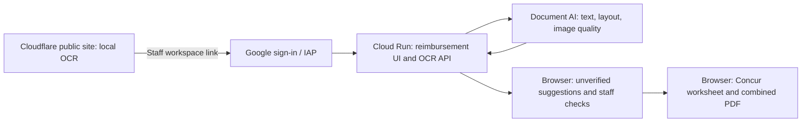

# Google Cloud OCR pilot — updated 2026-10-05

## Current status

Implemented a private Cloud Run OCR service in `services/document-ocr/` and
repeatable synthetic benchmark scripts. Live Document AI evaluation completed
successfully. Cloud Run service and staff reimbursement UI are deployed. The
public Cloudflare site retains local OCR and links to the private cloud workspace.
IAP requires Google sign-in and allows only the project owner. Gmail-compatible
OAuth configuration is saved. The owner completed Google sign-in and the live
private UI was visually verified. Browser file-upload completion was not verified.

## Completed validation

- All 58 JavaScript tests passed, including cloud service and client routing tests.
- All 30 Python policy tests passed.
- The cloud-service tests use mocked Document AI responses; they verify request
  handling and provenance, not recognition accuracy.
- Generated ten synthetic receipts with five variants each (50 images).
- Ran a single-pass Tesseract AUTO baseline using the bundled English model.

| Variant | Tesseract AUTO: exact total AND date | Document AI: exact total AND date |
| --- | --- | --- |
| Clear | 10/10 | 10/10 |
| Mild blur | 10/10 | 10/10 |
| Severe blur | 0/10 | 10/10 |
| Tilted | 10/10 | 10/10 |
| Faint | 10/10 | 10/10 |
| Total | 40/50 | 50/50 |

Document AI live API latency: median 1,443 ms, p95 1,663 ms, including network
time from this machine. Processor version: `pretrained-ocr-v2.1-2024-08-07`.
Image-quality scores remained high even on the severe-blur synthetic variants;
quality scores alone must not be treated as evidence that financial fields are
correct. No model-specific field correctness calibration was performed.

These are ten unique synthetic receipts, not fifty independent real invoices.
The benchmark does not exercise the browser's full multi-pass OCR recovery.
Use identical files when comparing cloud models. Add authorized real photographs,
merchant layouts, glare, cropping, and ambiguous totals before making real-world
accuracy claims or choosing automatic suggestion thresholds.

## Deployed architecture

The same 50 synthetic images also passed through the deployed Cloud Run API:
50 completed, 50 exact total/date matches. This was checked through an authenticated
Cloud Run proxy before IAP was enabled. Anonymous application-config requests
returned 403; authenticated UI/config requests returned 200. `/healthz` is
intercepted by the Google frontend and returned 404; use `/api/health` instead.

## Later increments

1. Evaluate authorized real photographs, glare, cropping, and diverse layouts.
2. Compare Gemini/structured parsers on cases the initial OCR fails.
3. Add private object storage, durable queues, retention, and resumable review
   state. None of these persistence features is implemented in this pilot.

The service currently handles a single rendered image per request, with a 12 MB
limit and at most two concurrent operations per instance. It returns unverified
text with line locations, source hash, and image-quality defects. It does not
store documents. Deployment must require Cloud Run authentication; its source
upload is restricted to the isolated service directory.

No private receipt was uploaded during local validation. No CampusGroups or
Concur action was performed.

## Cloud resources and access

- Project: `project-f4f9600b-76ef-4632-895` (number `220386098482`).
- Processor: `projects/220386098482/locations/us/processors/a705a771f39dc95f`.
- Artifact Registry repository: `us-central1/revconnect-ai`.
- Cloud Run service: `revconnect-document-ocr`, region `us-central1`.
- Revision: `revconnect-document-ocr-00003-2nw`.
- Staff URL: https://revconnect-document-ocr-220386098482.us-central1.run.app/reimbursement/
- Cloudflare version: `6e186e4b-cb36-4f7d-96e1-675c10d12a3d`.
- Runtime identity: `revconnect-ocr`, with project Document AI API User.
- Build identity: `revconnect-build`, with source-bucket Object Viewer,
  repository-level Artifact Registry Writer, and project Logs Writer.
- Cloud Run invocation is restricted to the IAP service agent. IAP access is
  restricted to `oscarfjy@gmail.com`. No service-account key was created.
- IAP uses a generated custom OAuth client to support the owner's Gmail account.
  The project's existing consent-screen brand is "Jiaye Interview Studio";
  it was not renamed because it is shared with another application.
- Maximum service and revision instances: 1; concurrency 2; 512 MiB; 120 s timeout.
  These are capacity limits, not a hard spending cap.

The earlier IAM approval and default-build-identity blockers were resolved after
user authorization by using the dedicated runtime and build identities above.
