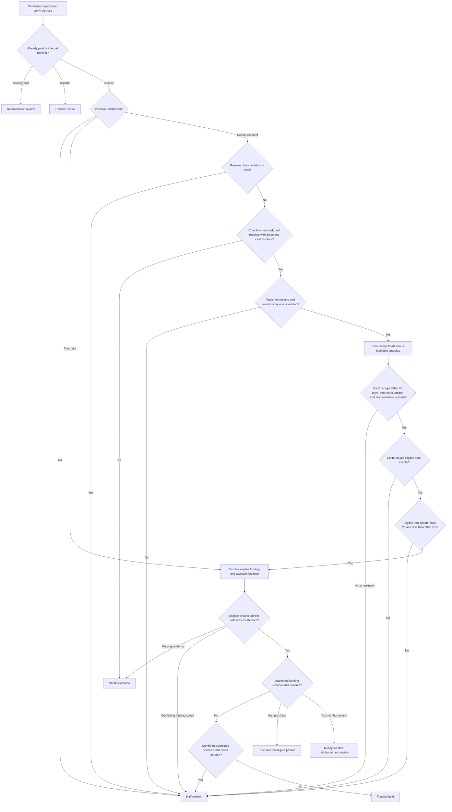
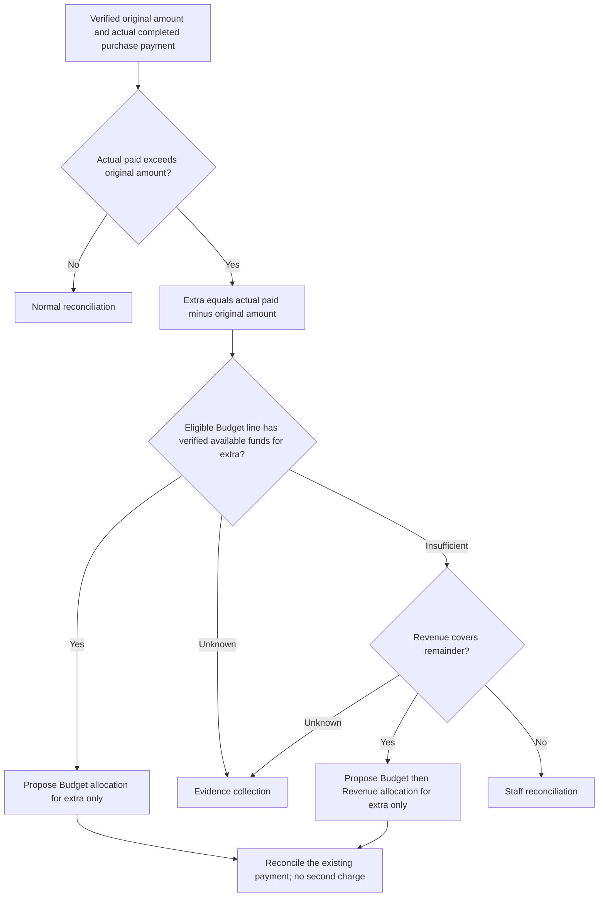

# Payment Request Agent Decision Tree

Version: `2026-09-26-draft-1`

Status: Reviewable design with confirmed core rules and explicit exception conditions.

Scope: Initial decision support for purchases and reimbursements. The application project remains paused.

## Confirmed office rules

The office user's explicit clarifications govern this design. Earlier research recorded form instructions; those observations do not override these clarifications.

| Rule | Operational meaning |
| --- | --- |
| Purchase initial review requires sufficient account funds only. | Once eligible, verified available funds cover the request, emit `PURCHASE_INITIAL_GATE_PASS`. Missing receipts, food event materials, or category information do not add business conditions to this first gate. |
| Reimbursements must match receipt amounts exactly. | Compare the requested amount against the verified eligible receipt total. A one-cent difference enters the staff review queue. |
| Multiple receipts may be combined. | Sum distinct, verified receipts; exclude duplicate copies and unrelated documents. |
| Combined reimbursement must be greater than $25 and less than $500. | The open interval is `2500 < eligible_total_minor < 50000`. Exactly $25 and exactly $500 do not pass the standard rule. No exception process has been confirmed. |
| Exclude ineligible items; retain all tax, shipping, and tips. | Eligible total equals final receipt totals minus verified ineligible item amounts. The user explicitly confirmed retaining all tax, shipping, and tips even after removing ineligible items; do not subtract a proportional share of those charges. |
| Amount discrepancies enter staff review. | Do not silently change the claim, round away the difference, or treat it as an approved reimbursement. |
| Initial funding follows the submitted allocation. | Check the submitted split first. Do not automatically switch the initial request to Budget. If a component is short despite enough combined funds, ask staff about an exception. |
| Actual purchase overruns prefer Budget, then Revenue. | Only after a completed purchase exceeds the original amount, propose allocating the extra amount to the eligible Budget line, using Revenue for any remainder. This does not authorize a new payment or relax reimbursement matching. |
| Initial review uses the system's current balance. | Do not subtract amounts from other initial-approved but unpaid requests. Preserve the balance snapshot and recheck when later action occurs. |
| Gasoline, transportation, and hotel reimbursements require manual processing. | Route these reimbursement categories to staff, including mixed receipts containing them. This rule does not add a category gate to purchase initial review. |
| Flowers and ammunition are ineligible for reimbursement. | Exclude their verified amounts. These are examples rather than a complete prohibited-category list. |
| Every reimbursement receipt must establish payment and show card last four. | Capture verified presence and evidence references; do not store actual card digits in the decision report. |
| Reimbursement submission must be within 60 days of purchase. | Check each receipt independently using verified calendar dates. Day 60 passes; day 61 needs staff review. |
| Reimbursement recipient cannot submit their own claim. | Compare verified person IDs, not display names alone. |
| Food reimbursements require a flyer or attendee list. | Either verified document type is sufficient under the user's confirmation. Determine food presence from receipt contents. |

Money in the evaluator uses USD integer cents. Currency must be explicit and verified; a dollar symbol alone does not establish it. This draft interprets the user's dollar limits as USD. Other currencies require review rather than an inferred conversion.

## Decision tree



The graph describes decision support. A purchase initial pass is the office's first-stage eligibility result, not proof of purchase, bank settlement, receipt collection, or final workflow completion. The evaluator performs no source-system writes. When actual stage advancement is implemented later, it must target the verified first-stage transition and recheck the balance before committing that action.

For reimbursements, every receipt retains its own purchase date, payment evidence, vendor, totals, and source references. Do not use a date or card detail from one receipt to fill another. A cart screenshot or a bank statement alone does not establish a complete itemized, paid receipt.

## Funding subroutine

1. Identify the eligible account or specific budget line for this request. Do not sum an organization's unrelated budget lines or duplicate UI balance fields.
2. Establish a verified system current balance, its source reference, currency, and observation time. Do not subtract pending/unpaid applications. Unknown balance is not zero and is not a funding pass. A verified negative balance cannot support a positive allocation; do not convert it to positive with an absolute value.
3. Verify the submitted allocation components sum to the requested amount. Check only the accounts with a nonzero submitted allocation; an unrelated account does not become a blocking condition.
4. Compare each submitted component with the corresponding verified available balance. Equality is sufficient: a $100 available balance can cover a $100 allocated component.
5. If a component is short but the combined balances of the submitted eligible sources could cover the request, emit `STAFF_REVIEW`. The user indicated allocation can be flexible, but clarified that initial preference is the submitted split. The agent must not invent an initial reallocation exception.
6. If the combined verified balances of those sources cannot cover the request, emit `FUNDING_HOLD`. Unknown evidence produces its own outcome rather than being treated as insufficient money.

The evaluation is a snapshot, and the user explicitly chose not to reserve money for unpaid applications at this gate. Multiple requests can therefore pass against the same displayed funds. A pass does not reserve funds or guarantee sufficient funds at later payment time. Rechecking current balances at the operational stage is a separate requirement; this offline evaluator does not implement production approval or payment.

## Separate post-purchase overrun branch



The original allocation remains the starting point. This branch accounts for the extra amount only; it does not move the entire payment to Budget. If Budget cannot cover the extra, Revenue may cover the remainder. If both sources are insufficient, staff reconcile the already-completed payment. The evaluator accepts `purpose: "purchase_overrun"` for this separate branch, with `approved_amount_minor`, `approved_amount_verified`, `actual_paid_amount_minor`, `actual_payment_verified`, `actual_payment_evidence_ref`, `overrun_budget_scope_id`, and, when needed, `overrun_revenue_scope_id`, plus the normal verified currency and funding facts. A post-payment balance must represent funds available for allocating the extra without subtracting or restoring the same posted charge twice; its semantics require verification.

## Reimbursement arithmetic

For each unique receipt `i`:

```text
eligible_i = verified_final_total_i - verified_ineligible_total_i
eligible_total = sum(eligible_i)
difference = requested_reimbursement - eligible_total
amount_match = (difference == 0)
amount_in_range = (2500 < eligible_total < 50000)  # USD cents
```

Final totals must include charges actually supported by the receipt. An estimate, pending cart total, or a different order's total is not interchangeable with the final receipt. `ineligible_total_minor` means verified ineligible item amounts only; all tax, shipping, and tips remain in the eligible total. Missing exclusions do not mean zero exclusions: the evaluator requires an explicit amount and a verified eligibility assessment. Zero is valid only when that assessment establishes no ineligible content.

The amount range is applied to the eligible combined reimbursement after exclusions. This follows the user's clarification that ineligible content is removed and the remainder counts. Staff should confirm any exception treatment rather than inventing it.

## Inputs an agent must establish

| Input | Why it is needed |
| --- | --- |
| Stable request ID; verified purpose and payment state | Distinguish a new purchase, reimbursement, already-paid reconciliation, or transfer. A form route label alone may not establish purpose. |
| Requested positive amount and verified currency/sign semantics | Prevent a negative ledger posting from becoming an invalid or inverted claim. |
| Eligible funding scope, available balance, snapshot reference, observation time | Make funding decisions traceable and avoid double-counting funds. |
| Receipt identity and verified uniqueness | Avoid counting multiple copies or overlapping order evidence twice. |
| Readability, itemization, purchase date, final total, excluded total | Support a strict, reproducible reimbursement calculation. |
| Field/document references and staff review references | Let staff inspect the original evidence and any discretionary determination. |
| Other reimbursement facts | Verified paid confirmation and card-last-four presence; submission/purchase dates; distinct submitter/recipient IDs; food event evidence. |

Verified input flags must come from an authorized source or recorded staff verification. An agent must not mark its own uncertain OCR or classification as verified. The current code accepts normalized facts; it does not retrieve attachments, authenticate to CampusGroups, perform OCR, verify reviewer identity, or reserve balances.

## Conditions awaiting office input

The core questions asked during design have been answered. The remaining exception conditions below apply only to their relevant branches; they do not add invoice or event-document requirements to the purchase initial gate.

| Policy field | Condition to supply | Current handling |
| --- | --- | --- |
| `initial_allocation_shortfall_exception_process` | If one submitted component is short but combined funds suffice, when may staff change the initial allocation? | Staff review; no automatic initial reallocation. |
| `additional_ineligible_categories` | Additional prohibited/conditional categories and exception rules beyond flowers and ammunition. | Staff must verify exclusions; selectable form categories are not eligibility permission. |
| `reimbursement_range_exception_process` | Are outside-range exceptions possible, and who authorizes them? | Staff review; no automatic pass outside the confirmed open interval. |

Additional later-stage conditions to define after initial review: purchase scheduling template and audience; vendor-account handling; contract/travel prerequisites; proof that payment occurred; delayed receipt due dates; verified Box storage; duplicate-payment checks; and final closure conditions. These are separate from the purchase balance-only first gate.

## Workflow conversation routing

The observed conversation entry points can be grouped into three audience classes. Two existing conversations were read: one applicant-facing conversation and one administrator-internal conversation. Team-scoped entries were identified, but their message bodies were not verified. Two images in an existing conversation were visually inspected. This coverage does not establish access to every request's conversations or any chat-export API.

| Audience class | Source channel pattern | Proposed agent use |
| --- | --- | --- |
| Applicant or participant conversation | `workflow_with_author`; `workflow_with_all_participants` | Draft missing-document requests, appointment instructions, and status notices, using the verified actual participant list. These two channel variants may have different audiences. |
| Administrator internal conversation | `workflow` | Draft processing records, actual purchase date, expected receipt date, and verified storage references. Do not expose these notes in the applicant channel. |
| Specific team conversation | `workflow_with_my_group_{team}`; `workflow_with_group_{team}` | Draft coordination for that team after verifying team scope and recipients. Do not assume every administrator can see it. |

Before any later messaging integration, bind a draft to the request ID, exact source channel, verified audience, purpose, supporting evidence, and office-approved English template. A similar-looking text box is insufficient evidence of its audience. A staff note saying a receipt is in Box is not proof of a stored file; keep storage claims separate from verified Box references. No conversation messages were sent during this design work, and the offline evaluator does not generate or send message drafts.

## Agent output contract

The [policy file](payment-request-agent-policy.json) names the rules and unresolved fields. The [offline evaluator](../scripts/evaluate_payment_request.py) produces JSON with:

- `request_id` and `policy_version`;
- `decision`, `checks`, and explanatory `reasons`;
- `eligible_total_minor` and `difference_minor` when receipt arithmetic is available;
- `pending_conditions` and traceable `evidence_refs`;
- a `proposed_funding` plan without editing the submitted allocation;
- `external_actions_performed: false`.

| Decision | Agent next step |
| --- | --- |
| `PURCHASE_INITIAL_GATE_PASS` | Record the first-stage result and proposed funding; subsequent actions use the separately authorized workflow. |
| `REIMBURSEMENT_READY_FOR_STAFF_REVIEW` | Present the amount reconciliation and verified check record to staff. This is not final approval or Concur submission. |
| `FUNDING_HOLD` | Show the funding shortfall and account scope. |
| `NEEDS_EVIDENCE` | Identify missing or unreadable information precisely. |
| `NEEDS_POLICY_INPUT` | Reserved for future unresolved applicable rules; the current evaluator routes the remaining allocation/eligibility exceptions to staff. |
| `STAFF_REVIEW` | Show the mismatch, conflict, exception, or uncertain fact. |
| `RECONCILIATION_REVIEW` | Inspect an existing payment and receipt/storage status. |
| `TRANSFER_REVIEW` | Use separate internal-transfer rules. |
| `OVERRUN_FUNDING_PROPOSAL` | Present a Budget-first, Revenue-remainder accounting proposal for the extra amount; reconcile the existing payment. |

The evaluator stops at the first blocking decision, while preserving checks already computed. It is not a complete all-findings auditor. A later agent can gather the remaining independent facts in parallel before presenting a consolidated review summary.

## Synthetic input example

This example contains no real submission or account details. A food purchase without a receipt or event flyer still passes the initial gate if its verified eligible funds are sufficient.

```json
{
  "request_id": "synthetic-purchase-001",
  "purpose": "purchase",
  "purpose_verified": true,
  "already_paid": false,
  "currency": "USD",
  "money_semantics_verified": true,
  "requested_amount_minor": 10000,
  "category": "Food",
  "submitted_allocations_verified": true,
  "submitted_funding_allocations": [{
    "account_scope_id": "synthetic-budget-line",
    "amount_minor": 10000
  }],
  "funding_pools": [{
    "account_scope_id": "synthetic-budget-line",
    "source": "budget",
    "currency": "USD",
    "eligible_for_request": true,
    "available_balance_minor": 10000,
    "balance_verified": true,
    "snapshot_ref": "synthetic-balance-evidence",
    "observed_at": "2026-09-26T12:00:00Z"
  }]
}
```

For reimbursement, additionally supply verified `submitter_id`, `reimbursement_recipient_id`, `parties_verified`, `submitted_date`, and `submitted_date_verified`. Each receipt needs `receipt_id`, `unique_verified`, `readable`, `itemized`, `purchase_date_present`, `purchase_date`, `purchase_date_verified`, `paid_confirmation_verified`, `credit_card_last_four_present_verified`, `currency`, `expense_tags`, `category_classification_verified`, `final_total_minor`, `ineligible_total_minor`, `totals_verified`, `exclusions_verified`, and `evidence_refs`.

If flowers or ammunition are present, `ineligible_items_fully_excluded` must be verified as true. Eligibility verification covers any other ineligible content as well; this version cannot automatically derive a complete university policy from the two prohibited examples. If any receipt contains food, supply `food_event_evidence` with `type: "flyer"` or `"attendee_list"`, `verified: true`, and `evidence_ref`. Receipt field evidence must support the verified flags. The code checks policy arithmetic and predicates, not the truth of undocumented assertions.

Run from the project directory, with a locally prepared normalized input:

```sh
python3 scripts/evaluate_payment_request.py /path/to/normalized-request.json
```

## Acceptance scenarios

All examples are synthetic. They assume other required facts are verified unless stated otherwise.

| Scenario | Expected result |
| --- | --- |
| Purchase $100; available eligible funds $100; no flyer or invoice | `PURCHASE_INITIAL_GATE_PASS` |
| Purchase $100; available eligible funds $99.99 | `FUNDING_HOLD` |
| Purchase with unresolved account balance | `NEEDS_EVIDENCE` |
| Purchase $100; Budget and Revenue balances suffice for their submitted components | First gate passes using the original split. |
| Purchase with a submitted-component shortfall despite enough combined funds | `STAFF_REVIEW`; no automatic switch to Budget. |
| Reimbursement $100; receipt $110 with $10 verified exclusions | Exact amount check passes; continue other reimbursement checks. |
| Reimbursement $100; two unique eligible receipts $40 and $60 | Exact amount check passes; continue other reimbursement checks. |
| Reimbursement $100; eligible receipts $99.99 | `STAFF_REVIEW`, difference +$0.01. |
| Reimbursement $25 or $500; matching receipts | `STAFF_REVIEW`, outside the confirmed open interval. |
| Reimbursement $25.01 or $499.99; matching receipts | Range passes; continue other checks. |
| Duplicate copies of one receipt, or unresolved exclusions | `STAFF_REVIEW`; do not infer a valid aggregate. |
| Already-paid staff-card request | `RECONCILIATION_REVIEW`; do not propose a new purchase. |
| Gasoline, transportation, or hotel reimbursement | `STAFF_REVIEW`, regardless of arithmetic passing. |
| Receipt missing paid confirmation or card last four | `NEEDS_EVIDENCE` |
| Receipt submitted 60 versus 61 calendar days after purchase | Day 60 passes timing; day 61 enters staff review. |
| Verified completed purchase exceeds original amount by $10; Budget can cover $10 | `OVERRUN_FUNDING_PROPOSAL`, extra only, no payment action. |
| Extra $10; Budget can cover $7; Revenue can cover $3 | Propose $7 Budget and $3 Revenue for the extra; original amount's allocation stays unchanged. |
| System current balance $100; another unpaid application requests $100 | Do not subtract the unpaid application at the initial gate. |

## Research provenance and publication

Validation: 24 synthetic acceptance tests passed, covering exact funding equality, allocation preservation, negative balances, unpaid-request treatment, multiple receipts, exclusions, retained incidental charges, amount boundaries, one-cent mismatches, per-receipt payment evidence, the 60-day boundary, identities, food evidence, manual categories, duplicate receipts, currency handling, and Budget/Revenue overrun proposals. These are rule tests rather than live CampusGroups or document-extraction tests.

Related work: [information catalog](payment-request-information-catalog-2026-09-26.json) and [research report](payment-request-automation-research-2026-09-26.md). No private submitted values, signed URLs, card details, or downloaded attachments are embedded in this design or evaluator. Public publication remains subject to the previously unresolved approval for the authenticated-system research; this version can be reviewed locally.
