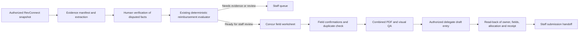

# Reimbursement Agent Harness

Status: design for an assisted, auditable RevConnect-to-Concur workflow. The reimbursement pilot in [Concur integration research](concur-reimbursement-integration-2026-09-26.md) establishes the observed UI behavior; the [payment request policy](payment-request-agent-policy.json) and [offline evaluator](../scripts/evaluate_payment_request.py) remain the source of the confirmed initial-review rules. This document does not authorize a new Concur report, attachment upload, submission, or RevConnect workflow change.

## Objective and operating boundary

For each reimbursement request, the harness should turn source material into a staff-reviewable decision and a verified Concur draft with a complete evidence package. It should reduce repeated entry of amounts, purchase dates, accounting codes, and documents while keeping the staff member in control of unresolved facts and financial actions. One request is one **case** and one Concur Expense Report. Several invoices/receipts are merged into one evidence PDF, while each distinct invoice/receipt gets its own expense within that report, per the office's September 28 clarification. Staff must resolve a document that covers several purchases or an invoice requiring itemization before applying this one-document-to-one-expense convention.

The harness is an execution contract around specialized workers, not one unrestricted browser agent. It defines what each worker may read, what evidence is required for each fact, which transitions require a person, and how a resumed run proves it is continuing the same case. A language model may propose extracted facts and wording. It cannot mark its own output verified, change the deterministic rule result, infer missing credit-card or identity evidence, or submit a report.

## Case contract and evidence provenance

Keep private case data and original documents outside Git. A case record holds stable source identifiers and references, not a copy of every page. Each extracted value has `value`, `source_ref`, `page_or_region`, `observed_at`, `extractor`, `confidence`, and `verified_by` fields. `verified_by` is populated only after a person or a separately trusted source check confirms the value; model confidence alone is insufficient. Store money as integer USD cents. Preserve the source's signed ledger amount and record the reviewed normalization to a positive claim amount separately.

| Case component | Minimum fields | Invariant |
| --- | --- | --- |
| Identity | RevConnect request ID/revision, submitter ID, recipient ID, organization and abbreviation, Concur owner identity | Resolve the reimbursement recipient separately from the submitter and acting delegate; verify the Concur **Acting as** context before entry. |
| Funding | Submitted Budget/Revenue components, exact budget line, current balance snapshots, observation times and basis | Initial review follows the submitted split and current system balances. Never silently reallocate a reimbursement or deduct pending unpaid requests. |
| Receipt | Stable file hash, vendor, purchase date, paid status, card-last-four **presence**, item list, gross total, excluded item amounts, eligible total, category tags, source pages | Each receipt is verified independently; do not put actual card digits in general logs or public documentation. |
| Event evidence | Flyer or attendee-list reference, file hash, verified relevance to the food claim | Required if any verified receipt line is food. |
| Concur plan | Report header values, one expense per distinct invoice/receipt, source-to-expense map, allocation per expense, combined PDF manifest | The single combined PDF is evidence packaging, not a single financial entry. |
| Action journal | Case ID, source revision, intended action, authorization scope, object IDs, before/after observations, timestamps | Record the observed result of each external action, including partial failures; never infer success from a click alone. |

The local evidence manifest should include SHA-256 hashes of every source file and the final PDF, plus page ranges in the output. The four-part package is: populated reimbursement heading, native CampusGroups request printout, original receipts, then supplementary materials. Merge all invoices/receipts into the same PDF, retaining a page-range link from each Concur expense to its corresponding source invoice/receipt. Keep all original receipt pages, including odd trailing pages, unless a staff member explicitly approves a different package. Verify the final PDF by reopening its AcroForm fields and rendering every page; extracted text alone is not enough. The filename is `Student Name_$Amount.pdf`. The pilot's blank GWID was a one-case instruction, not a default. The office has not yet specified whether the combined PDF is attached once at report level, to every expense, or in another supported arrangement; verify the tenant behavior before automating placement.

## Decision and preparation gates

1. **Intake:** Verify the request ID, revision, purpose, recipient, submitter, attachments, and signed amount semantics. If a request changes after extraction, invalidate downstream confirmations that depend on the changed fields.
2. **Receipt review:** Require each receipt's readable item list, purchase date, paid confirmation, and credit-card-last-four presence. Validate that each purchase is within 60 calendar days of submission. Detect duplicate files and apparent duplicate purchases for staff review; a repeated filename alone is not proof of duplication.
3. **Eligibility and math:** Route gasoline, transportation, and hotel to staff. Exclude verified flowers and ammunition amounts, and flag other uncertain categories. Keep all tax, shipping, and tips in the eligible amount after item exclusions. Sum eligible receipts in cents; require an exact match to the requested amount and the strict range `$25 < amount < $500`. Multiple receipts are allowed. An amount mismatch goes to staff review.
4. **Funding:** Evaluate the submitted Budget/Revenue split against verified current balances, using the existing evaluator. The codes are Budget `542302` and Revenue `542801`. In Concur, use **Allocate** to represent Budget and Revenue portions of each expense; the allocated amounts must sum exactly to that expense's eligible amount, and the expense allocations must reconcile to the request's reviewed funding split. An aggregate request split does not uniquely determine the allocation of each expense, so ask staff to confirm the per-expense distribution before entry. The pilot verified a 100% Budget default allocation; the Revenue code and mixed allocation controls still need direct tenant verification. A positive decision means **ready for staff reimbursement review**, not final approval.
5. **Concur preparation:** Produce a field worksheet showing every value, its source, and its confirmation state. Report name is `OrgAbbreviation_#RequestNumber_Reimb`; report-header business purpose is `Student Org Reimb`; Start and End dates span the submission month. Report Date is a separate field. Create a distinct expense proposal for each invoice/receipt, using that source's purchase date and eligible amount. Expense-entry business purpose is the organization name. Do not generalize the pilot's food expense type `52721-PROGRAM DEVELOPMENT ACTIVITY` to other categories.
6. **Draft and receipt:** Before any create action, search for an existing report linked to the request and verify the student delegate context. Create or continue only the authorized draft. After saving, read back report and entry values, the expense allocation, and the attached PDF's filename and rendered pages. A successful upload response without attachment association does not pass this gate.
7. **Handoff:** Staff review and final submission remain distinct. Only an observed Concur submission can justify a proposed RevConnect “Conur Submitted” stage; approval and reimbursement payment require their own evidence.

Do not duplicate the reimbursement policy in a second rule engine. The harness passes verified normalized facts to `scripts/evaluate_payment_request.py` and records its policy version, input hash, output, and evidence references. If the evaluator returns `NEEDS_EVIDENCE`, `STAFF_REVIEW`, or `FUNDING_HOLD`, the Concur entry plan remains a draft worksheet and no automatic financial action is queued.

## State machine and action permissions

| State | Entry proof | Permitted next step |
| --- | --- | --- |
| `DISCOVERED` | Stable request ID and read-only source URL | Capture source revision and authorized attachments. |
| `EVIDENCE_COLLECTED` | File hashes and provenance for all available material | Extract candidate facts and queue ambiguities. |
| `NEEDS_STAFF_REVIEW` | Missing, conflicting, or rule-blocked facts | Ask for specific corrections; no Concur write. |
| `RULES_VERIFIED` | Evaluator returns `REIMBURSEMENT_READY_FOR_STAFF_REVIEW` | Build a Concur worksheet; this is still staff review, not approval. |
| `FIELDS_CONFIRMED` | Case values and unresolved tenant mappings individually confirmed or covered by explicit office-wide conventions | Generate and inspect the PDF; check for an existing report. |
| `DRAFT_VERIFIED` | Authorized create/continue, correct delegate context, saved header/entries/allocations read back | Request specific authorization for any remaining attachment placement. |
| `ATTACHMENT_VERIFIED` | File and target expense/report explicitly authorized; viewer and saved list show correct attachment | Hand off for staff submission. |
| `SUBMITTED_OBSERVED` | Concur status or receipt proves actual submission | Propose source workflow reconciliation; do not equate submission with payment. |

An action token should bind **case ID + source revision + student Concur identity + exact action + destination object + document hash**, and expire when those inputs change. The pilot's authorization for one attachment must not carry over to another case. A report-create retry first checks the journal and Concur report list for the expected name, owner, request reference, and report ID. A save retry checks whether the expense or receipt already exists. UI drift, a missing **Acting as** indicator, a conflicting amount, or a different owner stops writes and returns to staff review. Draft creation, receipt upload, final submission, messages, and RevConnect stage changes are separate capabilities; no single approval token covers all of them.

## Adapter design

| Adapter | First implementation | Later option |
| --- | --- | --- |
| RevConnect intake | Authorized read-only browser snapshot and manually selected downloads | Institution-authorized CampusGroups export/API only after access and field coverage are confirmed. |
| Extraction | Local PDF text plus rendered-page inspection; optional local OCR/model for suggestions | Hosted model only if school privacy terms and an actual free-tier fit are confirmed. |
| Decision | Existing offline evaluator and policy JSON | Same rules behind a service, after versioning and audit tests. |
| PDF builder | Local AcroForm fill, document merge, hash and visual verification | Server-side generation after document-storage permissions are settled. |
| Concur | Assisted delegate UI with before/after read-back; use Allocate for each expense's Budget/Revenue split | Official API only after GW tenant authorization, OAuth scopes, entry and document operations, and costs are verified. |
| Orchestrator | Local encrypted case folder and resumable journal | Approved institutional system; Cloudflare free-tier Worker can host only nonsensitive coordination if usage, retention, and access controls fit the user's free-only constraint. |

Zapier or Copilot can orchestrate approved notifications or assist extraction, but neither supplies CampusGroups or Concur authority by itself. No third-party automation should receive student receipts, card evidence, or GWIDs before institutional permission and data handling are established. A small offline harness can be useful immediately without a paid model or hosted service.

## Deployment recommendation

The full harness is not yet implemented or deployable. The repository currently has the offline initial-review evaluator and this design; the intake, PDF builder, journal, and Concur adapter remain to be built and tested.

**Phase 1: office-managed local runner.** Package the review-packet generator and PDF builder as a versioned Python command on a staff-controlled computer. Keep the code in this repository, but store case files, originals, combined PDFs, and the resumable journal in an access-controlled local or GW-approved Box location outside Git. The runner processes one selected request at a time in the staff member's authorized browser session. Its first release performs read-only intake and local generation; staff compare the worksheet to RevConnect and Concur. Subsequent releases add explicitly authorized delegate draft and receipt actions with read-back. Pin dependencies, run synthetic regression fixtures in CI, and require an office staff member to approve each release before use with real cases. Neither a public website nor a Cloudflare Worker should be the document processor for this phase.

**Phase 2: optional shared queue.** If GW approves the data flow and staff need multi-user coordination, a private service can hold only case IDs, stage, assignee, timestamps, and non-sensitive audit references. Keep source PDFs and identifiers in the approved document store. The existing public RevConnectAI site at `cjsrxzdyzds.com` must not expose a reimbursement queue or student files. A Cloudflare Free Worker is suitable only for a tiny, non-sensitive coordination API after authentication and quota behavior are tested; its [10 ms CPU limit](https://developers.cloudflare.com/workers/platform/limits/) makes PDF rendering, OCR, and browser automation poor fits. Under the user's strict free-tier constraint, do not enable [R2](https://developers.cloudflare.com/r2/pricing/), [D1](https://developers.cloudflare.com/d1/platform/pricing/), Workers AI, or other metered services for this workflow without a verified hard stop before free allowances are exceeded. If a hard stop or institutional privacy approval is unavailable, stay local.

**Release gate:** A deployment must prove zero write actions in read-only mode, correct owner and delegate-context checks, exact cent-level reconciliation, one expense per distinct invoice/receipt, allocation totals per expense and per case, correct PDF page mappings, and idempotent resume after a simulated timeout. Real-case pilots should start with a few staff-reviewed cases; the harness is not a public self-service reimbursement portal.

## Evaluation harness and first implementation slice

Use de-identified synthetic fixtures and a few staff-reviewed private cases. Replay the same case through extraction, rule evaluation, field planning, PDF generation, and a **mock** Concur adapter. Assert both the expected decision and the absence of forbidden actions. Keep private case files, screenshots, and PDFs out of the repository.

| Scenario | Expected invariant |
| --- | --- |
| Two paid receipts, total exactly matching a claim strictly inside the limits | Ready for staff review only after every receipt and funding fact is verified. |
| One missing card-last-four marker, unreadable item list, or absent food flyer/attendee list | Needs evidence; no Concur create. |
| One-cent claim/eligible-total mismatch; exactly $25 or $500 | Staff review; no rounding or boundary exception. |
| Mixed receipt with flowers and verified exclusion, or gasoline/transportation/hotel | Recalculate eligible amount for the former; route the latter to staff. |
| Same request replayed after a timeout following report creation | Find and reuse the existing report; never create a duplicate. |
| Source revision, delegate identity, PDF hash, or destination expense changes after authorization | Invalidate the affected authorization and stop the write. |
| PDF text extracts correctly but rendered page is blank or wrong | Fail package verification. |
| Upload dialog closes but no receipt appears on the saved expense | Remain unverified; do not mark handoff complete. |

The first useful implementation slice is a local **review packet generator**: normalized case input, existing evaluator result, missing-evidence list, Concur field worksheet with source references, and a proposed PDF manifest. It performs no browser writes. A second slice builds and visually verifies the combined PDF. Only then add assisted Concur draft entry with explicit per-action authorization and read-back. Measure staff corrections, time to a verified draft, duplicate attempts prevented, missing evidence caught, and any case where the harness proposed an incorrect pass. A financial false pass or wrong recipient is a release blocker.

## Decisions still needed from the office

1. When a single invoice contains several purchases or categories, when does the office use Concur itemization rather than a single expense for that invoice?
2. What category-to-expense-type map should apply beyond the confirmed single food case, and who owns changes to that map?
3. Verify the Revenue `542801` choice and the exact **Allocate** controls for a mixed-funded expense. Confirm where the combined PDF belongs when a report has several expenses.
4. What is the allowed source and blank-field policy for GWID in future heading PDFs?
5. Who can authorize draft creation, attachment upload, submission, and RevConnect stage changes, and which actions should remain staff-only?
6. Where may private case records and PDFs be stored, and what are the office retention and deletion requirements?

Until these are settled, the harness can still produce a review packet and verified PDF for a staff member. It must leave the corresponding Concur fields and transitions unresolved rather than guessing.
